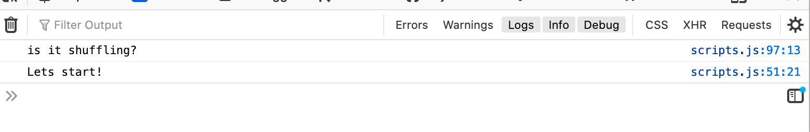

`python3 -m http.server`
  

# Donut Forget Pairs Game

Donut forget is a Pairs game for a single player. 

## UX

### User Stories
As a user I would like:
* To be challenged!
* Easily understand the gest of the game and start playing immediately. 
* To play a game that is visually appealing. 
* To play a game that really challenges my memory. 
* To play a game to pass time enjoyably. 
* To feel a bit under stress with a time counter. 
* To feel excited to finish the game as soon as I can, and play again to finish even faster. 

### Design

*Wireframes
The website was initially designed using Balsamiq to create several wireframes (link below). 
[Wireframes](assets/images/Wireframe.png) 

### Typography

I have used 2 Google fonts in designing this game. "Sacramento", cursive has been used for headings and "Open Sans", sans-serif has been used for paragraphs. These fonts complement each other very well by the pairings in Google fonts.  

### Colours

* Pink - is used for backgrounds and modals. 
* Black – all typography.
* Apricot – is used for a thin border on the start modal.

## Features

### Existing Features
* Start Button
    * The game starts with a start button in the game's modal. A short explanation suggesting the player to match cards is provided. When the button is clicked the game starts and the timer fires up. 
    
* Game page:
    * Title: "Donut forget" a funny play on words with "Don't forget", which also gives the player an idea that its a game to match different types of donuts. 
    * Timer that ticks up till 5 minutes, when the game stops and you have to start over. 
    * Animated cards when flipped and when a matching pair is found. The cards have 2 sides, at the start of the game the card has sprinkles, just like some donuts have. On the flip side are different types of round donuts, all duplicated, to make 18 different donut pairs. 

* End Game Button:
    * An ‘Exit’ button that will take the user back to the Home page.
    
### Features Left to Implement
* Additional card decks containing alternative objects. 
* Option to change to different difficulty levels.
* A high score counter. 
* Sound effects when a pair is matched and when a pair is not matched. 
* Use licensed images for game. 

### Technologies Used

Languages
* 46.8% [HTML5](https://en.wikipedia.org/wiki/HTML5)
* 23.9% [CSS3](https://en.wikipedia.org/wiki/CSS)
* 15.2% [JAVASCRIPT](https://en.wikipedia.org/wiki/JavaScript)

In Github the languages used are heavily reliant on HTML, this is probably because all of the images used are placed in <divs> in the HTML script. The CSS is also quite weighted due to the styling of the images to appear as circles in the game. 

Frameworks and Programs
* [JQuery](https://jquery.com/)
    * Used to enable interactive elements of the game.
* [Balsamiq](https://balsamiq.com/)
    * Wireframes were created in Balsamiq.
* [GitHub](https://github.com/)
    * Used to store and save coded work from Gitpod as repositories. It was also used to deploy the website.
* [Gitpod](https://gitpod.io/workspaces/)
    * Used to write out the Javascript, HTML and CSS code in its editor, as well as the README file. It also stored the images for game as well as wireframes. Also used Gitpod for Git add, status, commit and push the code to Github.  
* [Clipart Library](http://clipart-library.com/clipart/588576.htm)
    * Borrowed image for the backface side of the cards. 
* [Shutterstock](https://www.shutterstock.com/image-vector/donuts-set-american-sweet-dessert-chocolate-1080335852?src=ua9J0F8uWgNR-7sFKUEZpg-3-11)
    * Borrowed images for donut characters. 
* [Creative Market](https://creativemarket.com/search?q=donut)
    * Borrowed images for donut characters. 
* [Google Fonts](https://fonts.google.com/)
    * Used two complementary fonts for this game. 
* [Stack Overflow](https://stackoverflow.com/)
    * Used Stack Overflow to provide information on the randomisation of cards for this project, Count up timer, and general troubleshooting help. 
* [W3 Shools](https://www.w3schools.com/)
    * Used to help with the technicalites of writing good code. 

## Testing

### During the build
In the build of this game, it was continously previewed locally as each new function was added. Dev tools for Chrome and Firefox were used to make sure the layout was responsive for all screen sizes, with mobile first. I used console.log messages throughout to check the outputs validity and troubleshoot any issues. 
By playing the game, I tested the click events, for start, flipping, etc. For the flipping I ensured that it wasn't possible to click more than 2 cards before they had matched or flipped back. 
  
  

### Deployment
Once the game was deployed, it was tested on multiple devices and feedback was also requested from my children, friends and co-workers.  

### Responsive / Device testing
The following devices were used to test the site:
* 24" Monitor
* 15.6" Laptop Display
* 10" Galaxy Tab 4.0 (Portrait and Landscape)
* 5.8" Samsung S8 (Portrait and Landscape)
* 4.7" iPhone 8 (Portrait and Landscape)

### Code Validation
* [W3 HTML validator](https://validator.w3.org/#validate_by_input)
    * All HTML code was checked and any errors found were fixed.
* [W3 CSS validator (jigsaw)](https://jigsaw.w3.org/css-validator/#validate_by_input)
    * CSS code was checked and no errors were found.
* [JSLint](https://jslint.com/)
    * All JavaScript/JQuery code was checked to ensure all code complies with ES6 standards.

## User Stories

Do the initial goals of the user expectations meet the actual experience?
* To be challenged! Yes. "So many cards to match", "Wow, this is hard, some donuts are so similar" 
* Easily understand the gest of the game and start playing immediately. Yes. "Very straight-forward, I understood right away what the game was about".
* To play a game that is visually appealing. Yes. "Love the bubblegum pink color". "The way the title is it feels like an icecream shop or candystore". "I like that the cards to be flipped are round and not the usual square or rectangular". 
* To play a game that really challenges my memory. Yes. "Where is that same or rather similar donut again, so hard to remember!"
* To play a game to pass time enjoyably. Yes. "I played it while I was waiting for my lunch to warm up, et voila, game won, food done"
* To feel a bit under stress with a time counter. Yes. "Shoot, I timed out. I have to play again and go faster this time". 
* To feel excited to finish the game as soon as I can, and play again to finish even faster. Yes. "After each time I played, I got a bit better and faster, in the end I was done in under 2 minutes". 

## Deployment
When the game was finished, these steps were taken to deploy successfully:
1. First, the repository section on GitHub was entered and the project link containing the website and wireframes to be deployed, was clicked on.
2. Then, the settings tab underneath the “MS2_Donut_Forget” heading, was clicked on to enter its settings.
3. Next, the settings page was then scrolled down until the sub-title “GitHub Pages” was found.
4. Later, under “GitHub Pages” a sub-title called “Source” was located. Under the “Source” sub-title was a button labelled “None”. This “None” button was clicked on to reveal a dropdown menu.
5. In the dropdown menu the option called “master branch” was selected.
6. After selecting the “master branch”, the webpage refreshed automatically and deployed the website.
7. Finally, the link to this newly deployed website, was taken from the “GitHub Pages” section, https://monanorremo.github.io/MS2_Donut_Forget/

### Running the code locally
In order to locally run this code, this project would have to be cloned from GitHub using the following steps:
1. First enter the list of repositories section of GitHub.
2. Then, under the repository name of the project, click on the “Code” button.
3. Next, when in the dropdown “Clone with HTTPS” section click the clipboard button next to the URL to copy the repository's clone URL.
4. Afterwards, enter into the local IDE and open Git Bash.
5. Then, change the current working directory into the location of where the cloned directory is to be made.
6. Next, type in “git clone” and paste in the URL that was copied earlier from the “Clone with HTTPS” section i.e.:git clone: https://github.com/monanorremo/MS2_Donut_Forget.git
7. Lastly, tap the enter button on the keyboard to create the local clone.

## Credits

### Media
Some of the content for this website was taken from the following sources:
* Shutterstock
* Creative Market
 
### Code
Some of the code for this website was taken from the following sources:

* Youtube:
    * https://www.youtube.com/watch?v=3uuQ3g92oPQ&t=1907s
    * https://www.youtube.com/watch?v=bbb9dZotsOc&t=1630s
    * https://www.youtube.com/watch?v=ZniVgo8U7ek&t=474s
    * https://www.youtube.com/watch?v=Eq4bUSWGv1Y&list=LL2enFJYYjL4OCp7Cu37PM2g&index=5&t=858s
    * https://www.youtube.com/watch?v=zEo42QuZPJw&list=LL2enFJYYjL4OCp7Cu37PM2g

## Acknowledgements
I would like to thank my mentor Adegbenga Adeye and my patient children for letting me work on my milestone project. 